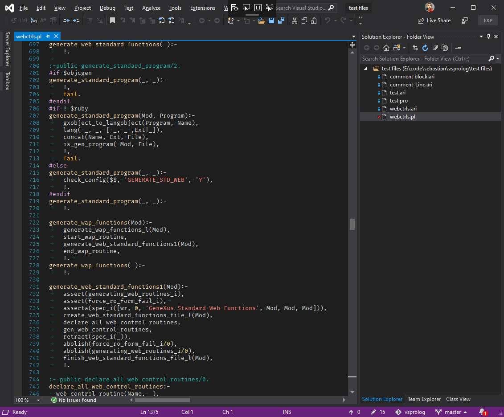

VSProlog
========

VSProlog enables syntax coloring and the award winning "Go to Definition" command on Prolog source files (*.ari & *.pl).

Get the compiled vsix from the [Visual Studio extensions library](https://marketplace.visualstudio.com/items?itemName=sebastiangomez.vsprolog2019)